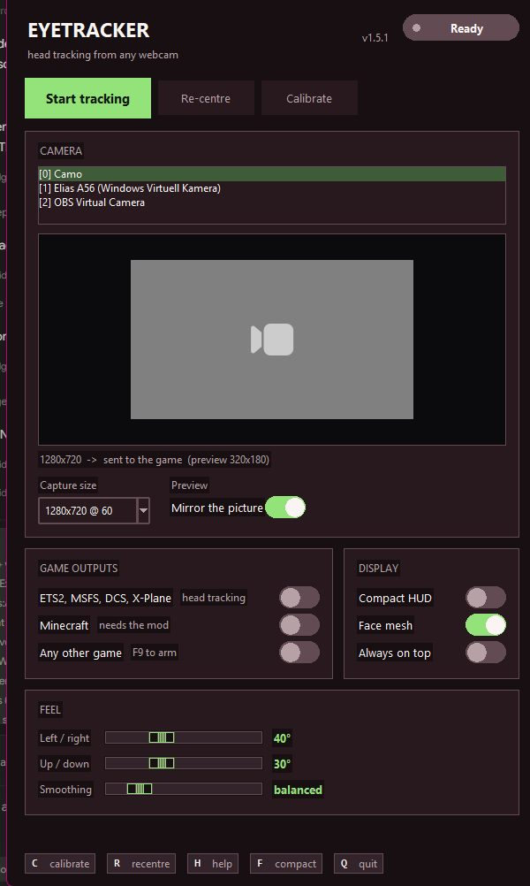
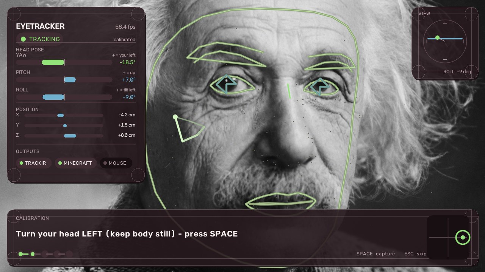
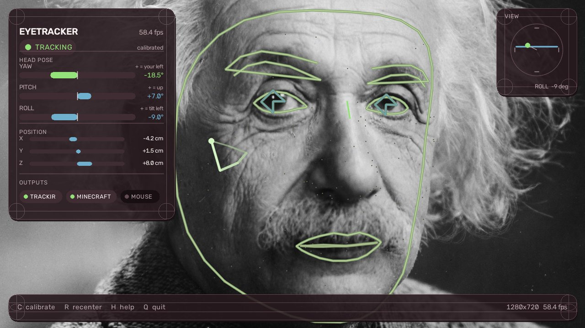
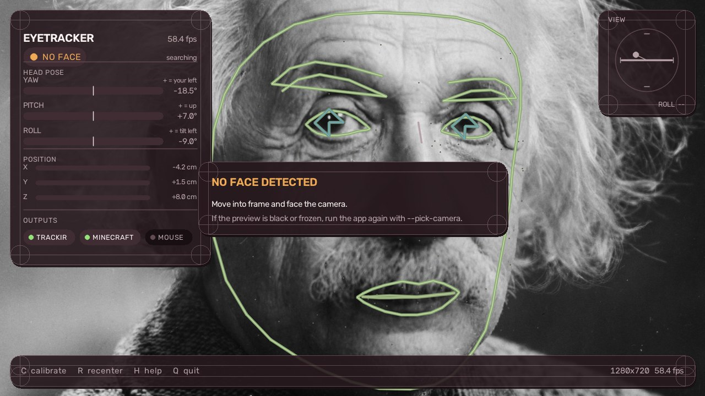

# Installation guide

Step-by-step setup for Eyetracker. For what the project *is*, see the
[README](README.md); this file is just the "how do I actually get it
working" path.

There is no installer. You download one file and run it.

---

## 1. Choose your route

| I want to… | Go to |
|---|---|
| Play a game, no fuss | [Quick start](#2-quick-start-the-5-minute-version) |
| Play Minecraft | [Quick start](#2-quick-start-the-5-minute-version), then [Minecraft](#5-minecraft-262) |
| Use a phone as the camera | [Phone as camera](#6-using-a-phone-as-the-camera) |
| Run from source / develop | [From source](#7-running-from-source) |
| Check it works | [Verify](#8-verify-the-install) |
| Something's wrong | [Troubleshooting](#9-troubleshooting) |
| Redo the setup | [Redo any of it](#redo-any-of-it) |

---

## 2. Quick start (the 5-minute version)

1. **Download `Eyetracker.exe`** (~113 MB) from the
   [releases page](https://github.com/Elias2012-dev/Eyetracker/releases/latest/download/Eyetracker.exe).

   One file. No Python, no pip, no installer, no admin rights.

2. **Put it anywhere you like** — Desktop, a games folder, wherever.
   It is self-contained and writes nothing next to itself.

3. **Double-click it.** A **settings window** opens. It lists every camera
   Windows reports and shows a live picture of the one currently selected,
   so you can tell a webcam from a virtual camera before you commit.

   

   > **First launch takes a few seconds** — it unpacks itself into a temp
   > folder before the window appears. A console window may flash past;
   > that's normal.

4. **Pick your camera.** If the picture is not what you want, click another
   entry in the list — the preview switches immediately. The caption under
   the picture tells you the real capture size being sent to the game
   (`1280x720 -> sent to the game`). If a camera shows
   *“no frames from this camera”*, that device is unusable on this
   machine; choose another.

5. **Press `Start tracking`.** The tracker window opens and follows your
   head. Tick the games you play under **Game outputs** — leave the defaults
   if you are not sure.

6. **Press `Calibrate`.** Follow the big prompt — look centre, left, right,
   up, down — pressing `SPACE` to capture each pose. About 30 seconds, and
   it makes everything feel right afterwards.

   

   | What you see | What to do |
   |---|---|
   | `CALIBRATION` · `STEP 2 OF 5` | the progress pips along the bottom fill in as you go |
   | the big prompt | do exactly what it says |
   | the viewfinder on the right | where to point your head |
   | the green `TRACKING` pill, top left | you are in frame — if it says `NO FACE`, the light is wrong |

   Press `ESC` to skip it and just start tracking; press `C` later to
   calibrate properly.

   

7. **You are done.** Leave the windows open, start your game — it loads the
   tracker's DLL and does not need to know anything about it — and turn
   head tracking on in the game's own options
   ([per-game setup](#4-per-game-setup)).

> The camera is only ever open in one place. The preview lets go of it when
> you press **Start tracking** and picks it back up when you press **Stop**,
> so the two never fight over the device.

### Redo any of it

Most of it you can just do in the window — every setting saves as you change
it.

| Situation | Where |
|---|---|
| wrong camera, or a webcam arrived later | click it in the window's camera list |
| recalibrate | **Calibrate** in the window, or press `C` in the tracker |
| recentre after moving your chair | **Re-centre**, or press `R` |
| pick a camera from a terminal instead | `Eyetracker.exe --pick-camera` |
| redo the old guided first-run flow | `Eyetracker.exe --first-run` |
| skip the settings window entirely | `Eyetracker.exe --no-gui` |

`--pick-camera` lists every camera Windows reports. Type a number, or part
of a name. The choice is saved **by device name**, so it survives reboots
that renumber the devices. Choosing a camera in the window does the same
thing.

### The keys

Everything is a key in the tracker window — press `H` in there any time to
see this list.

| Key | Action |
|---|---|
| `C` | start the calibration wizard (`SPACE` captures, `ESC` skips) |
| `R` | recentre on how you sit right now |
| `H` | show / hide the key list |
| `M` | show / hide the face mesh |
| `F` | switch between the camera view and the compact HUD (remembered) |
| `Q` / `ESC` | quit |
| `F9` | arm/disarm the mouse output (global) |

### Windows SmartScreen

The build is not code-signed, so Windows may show
*"Windows protected your PC"*. Choose **More info → Run anyway**. This is
the normal reaction to any unsigned binary; every build here is
reproducible from the source in this repo if you'd rather check it
yourself.

---

## 3. Requirements

* **Windows 10/11** for the game link, the mouse output and the registry
  bridge. The tracker core itself is cross-platform (OpenCV + MediaPipe).
* **A webcam** — or a phone acting as a Windows virtual camera
  ([below](#6-using-a-phone-as-the-camera)).
* ~1 GB free disk for the temp unpack.
* **Nothing else.** No TrackIR, no FreeTrack, no Tobii, no drivers, no
  virtual device, no separate tracker software to configure or keep
  updated. All of it is in this repository.

To track from **another PC** on your network, change `udp_json.host` /
`bindAddress` — that is the one thing that needs a firewall rule.

---

## 4. Per-game setup

Start the tracker **before** the game.

### ETS2 / ATS

*Options → Gameplay → TrackIR: on.*

Axis direction and range are adjusted in-game.

### Farming Simulator 25 / 22

*Options → General → head tracking: on.*

Both run on the GIANTS engine, which loads a TrackIR client the same way
ETS2 does.

Not moving? Open the game's `log.txt` and find the `Head Tracking System`
line — it names the system the engine picked:

* `TrackIR Client` — the engine found our bridge; the problem is in-game
  settings.
* `none` — it never found it. Start the tracker before the game, and check
  the game is 64-bit (our bridge DLLs are 64-bit only).

### MSFS, DCS, X-Plane 12, War Thunder, ACC, DayZ, IL-2

Enable head tracking in the game's own options. No extra setup.

### Any mouse-look game (no TrackIR support)

```
Eyetracker.exe --mouse
```

Press `F9` to arm the mouse output — **it starts disarmed on purpose**, so
it never steals your cursor while you're doing something else. Lower the
game's mouse sensitivity if it feels fast; windowed or borderless is most
reliable.

---

## 5. Minecraft 26.2

Needs **Fabric Loader** and **Fabric API** installed in Minecraft first.

1. Download
   [`freebuff-eyetrack-1.0.0.jar`](https://github.com/Elias2012-dev/Eyetracker/releases/latest/download/freebuff-eyetrack-1.0.0.jar).

2. Drop it in your `mods` folder:

   | Platform | Path |
   |---|---|
   | Windows | `%appdata%\.minecraft\mods` |
   | macOS | `~/Library/Application Support/minecraft/mods` |
   | Linux | `~/.minecraft/mods` |

3. Start Minecraft. Check the mod list on the main screen shows it loaded.

4. Start `Eyetracker.exe` **before** Minecraft, and calibrate (`C`).

5. In game:

   | Key | Action |
   |---|---|
   | `H` | toggle head tracking on/off |
   | `J` | recentre to your current pose |

   Both are rebindable under *Options → Controls*.

### Minecraft tuning

Feels wrong? Edit
`config/freebuff_eyetrack.json` in your Minecraft folder:

| Key | Default | Meaning |
|---|---|---|
| `yawSensitivity` / `pitchSensitivity` | `1.0` | degrees of view per degree of head |
| `yawRange` / `pitchRange` | `40` / `30` | normalisation range for the curve |
| `yawGamma` / `pitchGamma` | `1.0` | `<1` snappier near centre, `>1` calmer at the edges |
| `invertYaw` / `invertPitch` | `false` | flip axes |
| `staleTimeoutMs` | `500` | drop to "face lost" after this silence |

Axes moving the wrong way is the one thing you cannot un-set by tuning —
flip the `invert*` flags and restart Minecraft.

---

## 6. Using a phone as the camera

Your phone can be a webcam with no extra hardware. Pick whichever app you
like — **Camo**, **Iriun Webcam**, **DroidCam**, **EpocCam**, or your phone
maker's own app (Motorola/Lenovo, Samsung, "Link to Windows"). They install
a Windows virtual camera that shows up as a normal webcam.

1. Install the app and **start streaming** — a virtual camera that isn't
   being fed outputs a black frame.
2. Confirm Windows sees it:
   *Settings → Privacy & security → Camera*, or simply run
   ```
   Eyetracker.exe --list-cameras
   ```
   It should appear as e.g. `Pixel 8 (Windows Virtuell Kamera)` — Windows
   names virtual cameras after the phone model.
3. Select it:
   ```
   Eyetracker.exe --pick-camera
   ```

The choice is saved **by device name**, not index — so it keeps working
after a reboot even if Windows renumbers the devices.

A phone on Wi-Fi introduces latency; USB tethering is noticeably better if
it bothers you.

---

## 7. Running from source

Use this if you want to change the code, verify the published binary, or
build the mod.

**Requirements:** Windows, Python 3.10–3.13 (3.13 recommended). ~1 GB for
the virtualenv.

```bash
git clone https://github.com/Elias2012-dev/Eyetracker.git
cd Eyetracker

run.bat                # creates .venv, installs deps, starts tracking
```

That's it — `run.bat` creates the virtualenv, installs `requirements.txt`,
and runs the tracker. Pass any flag through it:

```
run.bat --pick-camera      # choose a camera
run.bat --list-games       # what the tracker supports
run.bat --game fs25        # apply a game's preset + print its notes
run.bat --mouse            # enable the mouse output
run.bat --paths            # where config, model, DLLs and log live
run.bat --help             # every option
```

The MediaPipe face model (~3.8 MB) downloads into `models/` on first run.

### Building the exe yourself

```bash
build_exe.bat              -> dist\Eyetracker.exe      (one file, ~113 MB)
build_exe.bat --onedir     -> dist\Eyetracker\...     (folder, instant start)
```

Bundles the face model, the bridge DLLs and everything else, so the result
works offline.

### Building the Minecraft mod

```bash
cd minecraft-mod
gradlew.bat build          # Gradle downloads a JDK 25 for itself
```

Output: `minecraft-mod/build/libs/freebuff-eyetrack-1.0.0.jar`

### Where your data lives

Nothing is written next to the exe. Config, calibration and the log live in:

```
%APPDATA%\Eyetracker\
```

Run `run.bat --paths` (or `Eyetracker.exe --paths`) to print the exact
locations on your machine.

---

## 8. Verify the install

A 30-second sanity check, read straight off the window:

1. **Does the tracker see you?** The rail header should read `TRACKING` in
   green, with a green face outline on the video. `NO FACE` in amber means
   the face is not found → [troubleshooting](#9-troubleshooting).

   

2. **Are the numbers moving?** Turn your head and watch the yaw / pitch /
   roll meters. Direction should match the legend: `+ = your left`.

3. **Is the game receiving it?** The chips at the bottom of the rail light
   up per output — `TRACKIR`, `MINECRAFT`, `MOUSE`. A lit chip means that
   sink is actually sending; dark means it is configured but not tracking.

4. **Is it in the game?** Start the tracker first, then the game, and turn
   head tracking on. For Farming Simulator, check the `Head Tracking System`
   line in `log.txt`. The log should also show `[game-link] ... bridge
   registered` on first run.

5. **Does it read well in your peripheral vision?** Press `F`. If the game
   has the focus and the full window is in the way, the compact panel
   (`docs/compact.png`) is what you want — and it is remembered next time.

---

## 9. Troubleshooting

**Windows blocked the exe** — *More info → Run anyway*; it's unsigned.

**No face detected** — the rail pill says `NO FACE` in amber and a card
appears in the middle of the frame. Light *toward* your face, not from
behind you. Sit roughly 50–70 cm away. Check the camera is the right one
(`--list-cameras`). A virtual camera that isn't streaming shows black.

**The setup window says “Camera found” but there's no face** — that is a
lighting or framing problem, not a camera problem: it picked the best device
it could find. Fix the light, or run `--pick-camera` and choose another.

**The setup window hangs on “Looking for your camera…”** — it gives each
device about six seconds before giving up on it, and a virtual camera that
never delivers frames always uses the full six. With four cameras that is
~25 seconds, once. If it is genuinely stuck, plug in a real webcam (or start
your phone's companion app) and run `--no-first-run --camera 0`.

**Axes feel inverted** — every layer has its own flag, because games differ:

| Layer | Where |
|---|---|
| Tracker | `pose.invert_yaw` / `pose.invert_pitch` |
| Minecraft mod | `invertYaw` / `invertPitch` |
| Mouse output | `mouse.invert_x` / `mouse.invert_y` |
| ETS2/ATS/Farming Sim | the game's own axis inversion |

**Mouse doesn't move** — it starts *disarmed*; press `F9`. Confirm
`mouse.enabled` is true. Run the game windowed.

**Mouse too fast or too slow** — tune `mouse.sensitivity`, and lower the
game's own mouse sensitivity. Raise `mouse.deadzone_deg` if it drifts at
centre.

**Game shows no tracking** — start the tracker *before* the game. Then:

* Another tracker program on this PC may own the NPClient registry key.
  Close it, or re-run `run.bat --install-bridge` after it has started.
* Check the log for `[game-link]` lines.
* Farming Simulator: the `Head Tracking System` line in `log.txt`.
* Our bridge DLLs are **64-bit only** (see
  [`bridge/NOTICE.txt`](bridge/NOTICE.txt)) — a 32-bit game can't load them.

**View jitters or drifts** — recalibrate (`C`). Keep the camera centred on
your monitor. Lower `filter.min_cutoff` for smoother motion, raise it for
less lag.

**Movement feels too small or too large (Minecraft)** —
`yawSensitivity`/`pitchSensitivity`, or recalibrate.

**Firewall prompt** — everything defaults to loopback. Only change
`bindAddress`/`udp_json.host` if you deliberately track over LAN.

**Still stuck** — `run.bat --paths` prints where config, log, model and
DLLs live. The log at `%APPDATA%\Eyetracker\Eyetracker.log` usually says
what went wrong.

---

## Where to go next

* [README](README.md) — what this is, how it works, full config reference
* [Releases](https://github.com/Elias2012-dev/Eyetracker/releases) —
  downloads and changelogs
* [`--help`](README.md#run-it-as-a-standalone-exe) — every command-line
  option

Licence: MIT.